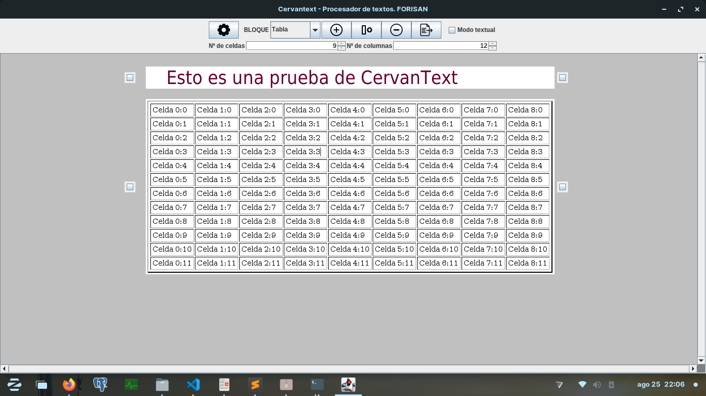

# CervanText. Un procesador de textos Web
Es un procesador de textos escrito en Java con la libería de GUI swing. Permite introducir los distintos elementos en el documento como si se trataran de bloques independientes.

Esta inspirado en el editor Gutenberg, de Wordpress, pues además de usar la tecnología de los bloques, Cervantext está pensado para exportar HTML.

De esta forma los párrafos, encabezados, imágenes y tablas están bien estructurados. Incluso se pueden añadir columnas.

Las fuentes disponibles son las que hay en el sistema. Esto reduce drasticamente el tamaño del ejecutable. Sin embargo tendrá que tenerlas instaladas.

Se puede cambiar la resolución de las imágenes si se tratan como un bloque independiente.

A través del bloque Tabla puedes crear una tabla a medida, seleccionando previamente el número de filas y columnas.

Los encabezados se comportan como h1, h2, h3 ... h6. Al igual que los párrafos son etiquetas p.

Para quienes tienen problemas distinguiendo iconos está el modo texto, para ver las opciones del menú explicadas con texto. 

